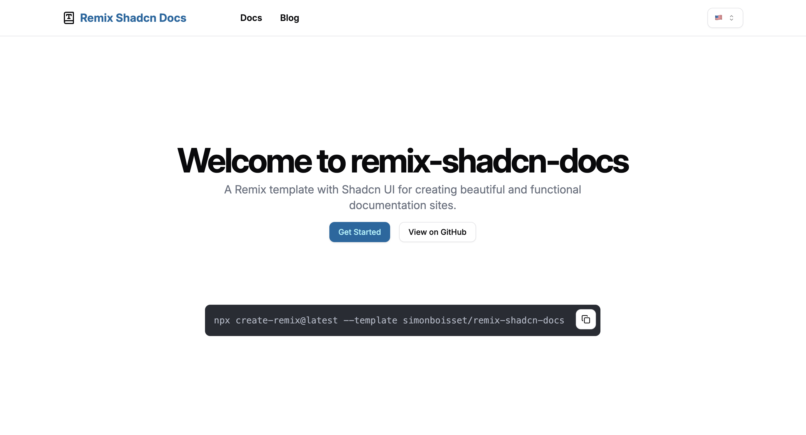

# Remix Shadcn Template

> **Important Update**: This template now supports React Router v7 and Tailwind CSS v4! You can now leverage the latest features from both React Router and Tailwind.



A comprehensive starter kit for building modern web applications using Remix and Shadcn UI.

## Features

- Pre-configured Remix setup with TypeScript
- Integration of Shadcn UI components
- Tailwind CSS configuration
- Responsive layouts
- SEO optimization
- Example pages and components
- Internationalization support
- Blog functionality
- Documentation system

## Tech Stack

- **Remix**: Used for server-side rendering, routing, and data loading.
- **Shadcn UI**: Provides a set of accessible and customizable UI components.
- **Tailwind CSS**: Used for styling, offering a utility-first approach to design.
- **TypeScript**: Ensures type safety throughout the project.

## Getting Started

To create a new project using this template, run:

```bash
npx create-remix@latest --template simonboisset/remix-shadcn-docs
```

After the project is created, navigate to the project directory and install dependencies:

```bash
cd your-project-name
npm install
```

To start the development server:

```bash
npm run dev
```

## Project Structure

- `app/`: Contains the main application code
  - `components/`: Reusable UI components
  - `contents/`: Content management (blog posts, documentation, i18n)
  - `routes/`: Remix routes
- `public/`: Static assets

## Customization

### Tailwind Configuration

You can customize the Tailwind configuration in the `tailwind.config.ts` file.

### Internationalization

The template includes a built-in internationalization system. You can add or modify translations in the `app/contents/i18n/` directory.

### Documentation

The documentation system is set up in the `app/contents/doc/` directory. You can add new versions and languages as needed.

### Blog

Blog posts can be added in the `app/contents/blog/` directory, organized by language.

## License

This project is licensed under the MIT License. See the LICENSE file for details.

## Contributing

Contributions are welcome! Please feel free to submit a Pull Request.

## Support

If you have any questions or need help, please open an issue in the GitHub repository.
